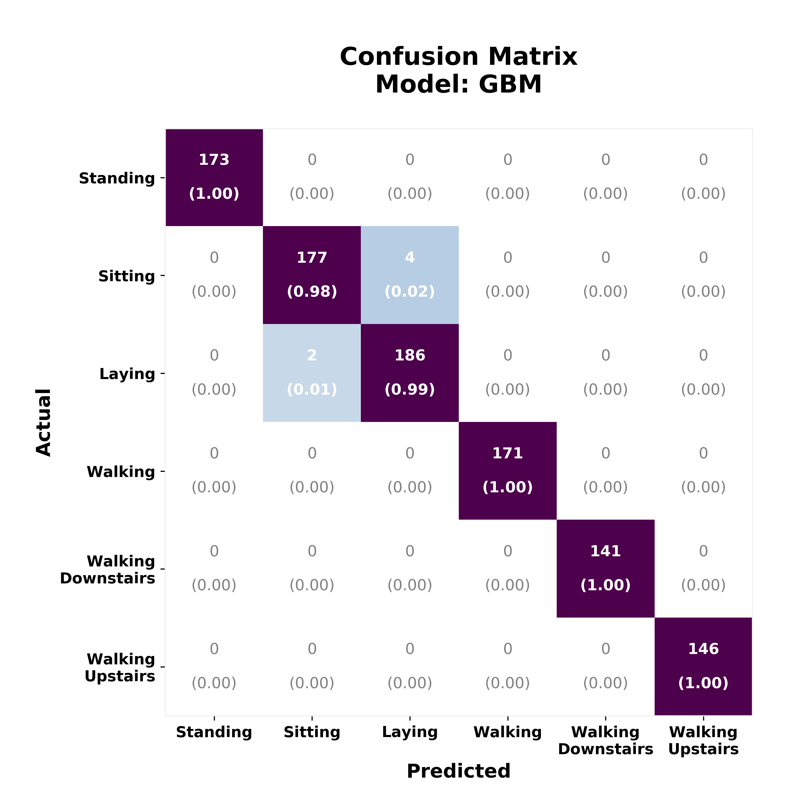

 
<a href="http://nbviewer.jupyter.org/github/reyvaz/Human-Activity-Recognition/blob/master/human_act_rec.ipynb" target="_blank">Click Here</a>
to see the Notebook online in Jupyter nbviewer.

# Human Activity Recognition

#### Notebook testing various classification algorithms to detect human activity from mobile phone accelerometer and gyroscope data

The best performing algorithm is a GBM Classifier with **99.4% accuracy** and average precision, recall, and F1 of over 99% on 6 classes. 

The data comes from Anguita et al., (2013). The original dataset and more information can be found at this [UCI Machine Learning Repository](https://archive.ics.uci.edu/ml/datasets/human+activity+recognition+using+smartphones). For this analysis, the data was downloaded from [Kaggle](https://www.kaggle.com/uciml/human-activity-recognition-with-smartphones/data). 

#### Contents:

- [human_act_rec.ipynb](human_act_rec.ipynb): Jupyter notebook with the Python code to process the data, the algorithms, and report.
- [cm_heat_plots.py](cm_heat_plots.py): A Python script with functions to plot the confusion matrices
- [confusion_matrixGBM.png](confusion_matrixGBM.png): An output image.
- [README.md](README.md): This File  

 

 

 
